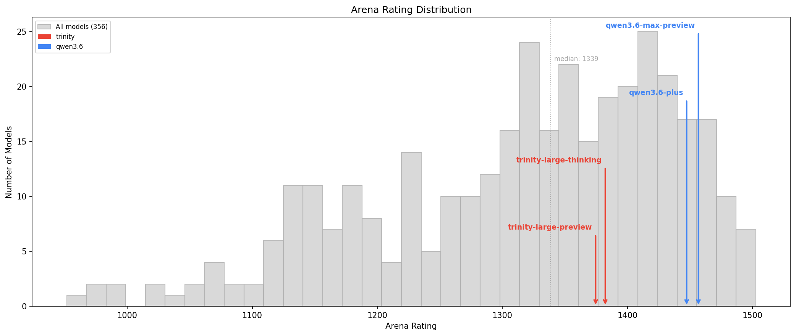
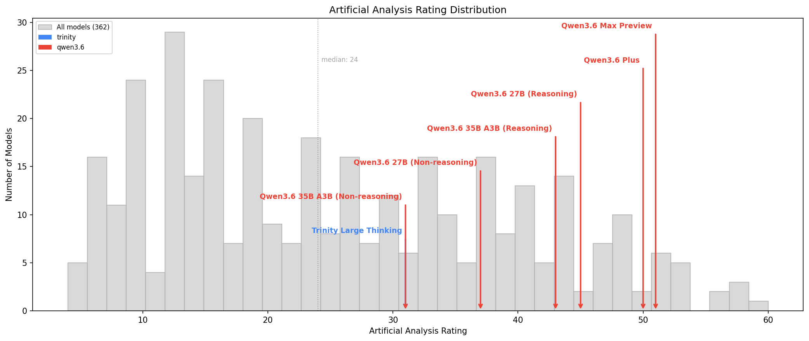

# Model Comparison: trinity vs qwen3.6

**Date:** 2026-05-04

This document compares trinity and qwen3.6 using 2 independent evaluation sources. Each source may evaluate different model variants, so the sections should be read as complementary views rather than direct cross-references.

| Section | Models Found | Evaluation Method |
|----------|-------------------------------------------------------------------------------------|-------------------|
| [Part 1: Arena](#part-1-arena) | qwen3.6-max-preview, qwen3.6-plus, trinity-large-preview, trinity-large-thinking | Human Preference Ratings |
| | | |
| [Part 2: Artificial Analysis](#part-2-artificial-analysis) | Trinity Large Thinking, Qwen3.6 27B (Reasoning), Qwen3.6 35B A3B (Reasoning), Qwen3.6 27B (Non-reasoning), Qwen3.6 Plus, Qwen3.6 35B A3B (Non-reasoning), Qwen3.6 Max Preview | Automated Benchmarks |
# Overall Conclusions

1. **Overall positioning:** Qwen3.6 operates at the Near-frontier to Upper-mid tier, while Trinity sits squarely in Mid-tier territory. In Arena, Qwen3.6 Max Preview ranks 31st of 356 models (rating 1456.7), placing it alongside Claude Sonnet 4.5, GPT-5.1, and Gemini 2.5 Pro. Trinity Large Thinking ranks 133rd (rating 1382.2), near GPT-4.1 Mini and Mistral Medium. In AA benchmarks, the gap is equally stark: Qwen3.6 Max Preview scores 51 on the Intelligence Index (rank 16 of 362), while Trinity Large Thinking scores 31 (rank 129). Both sources show clear separation between the two families.

2. **Lineup depth:** Qwen3.6 offers a broader lineup: 2 API-tier models (Max Preview, Plus) and 4 open-weight variants in AA (27B and 35B in both reasoning and non-reasoning modes). Trinity has just 2 models total: trinity-large-thinking and trinity-large-preview, with only the thinking variant benchmarked in AA. Qwen3.6's lineup spans from the Near-frontier (Intelligence 51) down to Mid-tier (Intelligence 31), covering a wider range of deployment needs.

3. **Value proposition:** Trinity's strongest case is operational efficiency. On AA benchmarks, Trinity Large Thinking is 3.7x faster than Qwen3.6 Max Preview (141 vs 38 t/s), has 4.2x lower latency (0.49s vs 2.04s TTFT), and is 7.4x cheaper ($0.40 vs $2.92/1M blended tokens). Even against the more affordable Qwen3.6 Plus ($1.12/1M), Trinity is still 2.8x cheaper. However, this cost advantage comes with a significant quality gap. For users who need maximum quality, Qwen3.6 is the clear choice; for latency-sensitive, budget-constrained applications, Trinity offers a compelling speed/cost trade-off.

4. **Quality profile differences:** In Arena's head-to-head data, Qwen3.6 has a STEM-leaning advantage profile, with its largest margins in math (+106.9 avg) and industrial mathematics (+103.8 avg). Its smallest advantage is in coding (+65.6 avg), where Trinity's relative strength shows through — Trinity Large Preview actually scores 1442.2 in coding, competitive with many higher-ranked models. Creative writing shows a moderate gap (+66.1 avg), suggesting Trinity's conversational and creative capabilities are somewhat closer to Qwen3.6 than its STEM capabilities.

5. **Tier-matched comparison:** At the same intelligence level, Trinity holds its own. In AA, Trinity Large Thinking (Intelligence 31, Coding 27) matches Qwen3.6 35B A3B Non-reasoning (Intelligence 31, Coding 17) while delivering higher coding scores, faster inference (141 vs 189 t/s), lower latency (0.49s vs 1.36s), and a lower price ($0.40 vs $0.84/1M). This suggests that within its tier, Trinity is a strong competitor — the quality gap only appears when comparing against Qwen3.6's top-tier API offerings.

6. **Evaluation coverage:** Trinity has limited evaluation coverage: only 1 model in AA and 2 in Arena. Qwen3.6 has 6 models in AA and 2 in Arena. Neither source reports context window or parameter counts for these models, limiting architecture-level comparisons. The AA comparison necessarily compares Qwen3.6's top model (a proprietary API offering) against Trinity's single evaluated model, which may not be a fair apples-to-apples comparison.

7. **Summary:**

   | Factor | Trinity | Qwen3.6 |
   |--------|---------|---------|
   | Top-tier quality (Arena) | 1382 (rank 133, Mid-tier) | 1457 (rank 31, Upper-mid) |
   | Top-tier quality (AA) | Intelligence 31 (rank 129) | Intelligence 51 (rank 16) |
   | Same-tier quality | Intelligence 31, Coding 27 | Intelligence 31, Coding 17 (35B A3B) |
   | Speed | 141 t/s | 38–199 t/s (varies by model) |
   | Latency (TTFT) | 0.49s | 1.36–2.04s |
   | Price | $0.40/1M blend | $0.56–$2.92/1M blend |
   | Coding (Arena) | 1430–1442 | 1498–1506 |
   | Math (Arena) | 1356–1396 | 1478–1488 |
   | Model variety | 2 models | 6 models (AA), 2 models (Arena) |
   | Open weights | Yes (Arcee) | Yes (27B, 35B variants) |

8. **Bottom line:** Qwen3.6 is the higher-quality family by a wide margin, operating 1–2 tiers above Trinity across both human preference and automated benchmarks. Choose Qwen3.6 when quality is the priority — its Max Preview and Plus models compete with the best in the industry. Choose Trinity when you need a fast, affordable, open-weight model with respectable coding ability and can accept mid-tier quality: at $0.40/1M tokens and sub-500ms TTFT, it's well-suited for latency-sensitive pipelines, high-volume inference, or as a cost-effective component in multi-model architectures.

---

# Part 1: Arena

**Source:** Arena

## About Arena

[Arena](https://lmarena.ai/) (formerly LMSYS Chatbot Arena) ranks models using **head-to-head human preference votes**. Real users submit prompts to two anonymous models side-by-side, then choose which response they prefer. These pairwise outcomes are aggregated into Bradley-Terry ratings (similar to Elo in chess) -- higher is better, with scores typically ranging from ~900 to ~1550.

The `text_style_control` variant adjusts for verbosity bias, so models don't get rewarded simply for producing longer responses.

Ratings are broken down into **27 topic-based categories** (coding, math, creative writing, legal, etc.) based on conversation content, giving a detailed profile of where each model excels relative to the full field. Because these are human judgments rather than automated test suites, they reflect what real users find helpful -- but they also carry the biases of the voter population (skewed toward AI-savvy early adopters) and the preference-vs-correctness gap (a confident but wrong answer can still win votes).

**Models evaluated:** qwen3.6-max-preview, qwen3.6-plus, trinity-large-preview, trinity-large-thinking

---

```{=latex}
\newpage
```

## Global Arena Rankings (356 models total)

\

| Rank | Model | Rating | Votes |
| ---:| ------| ---:| ---:|
| 26 | gemini-3-flash (thinking-minimal) | 1462.9 | 40,022 |
| 27 | deepseek-v4-pro-thinking | 1461.7 | 3,820 |
| 28 | kimi-k2.6 | 1460.0 | 6,168 |
| 29 | grok-4.1 | 1459.9 | 57,888 |
| 30 | dola-seed-2.0-pro | 1459.4 | 25,273 |
| **31** | **qwen3.6-max-preview** | **1456.7** | **3,943** |
| 32 | glm-5 | 1456.3 | 19,980 |
| 33 | gpt-5.4-mini-high | 1456.1 | 13,541 |
| 34 | grok-4.3 | 1455.7 | 2,505 |
| 35 | gpt-5.1-high | 1454.6 | 40,879 |
| 36 | claude-sonnet-4-5-20250929-thinking-32k | 1453.6 | 65,936 |
| 37 | claude-sonnet-4-5-20250929 | 1452.6 | 63,899 |
| 38 | gemma-4-31b | 1451.0 | 5,810 |
| 39 | ernie-5.0-0110 | 1450.7 | 27,672 |
| 40 | kimi-k2.5-thinking | 1449.5 | 26,123 |
| 41 | ernie-5.0-preview-1203 | 1449.2 | 9,770 |
| 42 | mimo-v2-pro | 1449.1 | 14,085 |
| 43 | claude-opus-4-1-20250805-thinking-16k | 1448.7 | 49,853 |
| 44 | gpt-5.3-chat-latest | 1448.4 | 21,109 |
| 45 | gemini-2.5-pro | 1447.7 | 113,545 |
| **46** | **qwen3.6-plus** | **1447.3** | **7,538** |
| 47 | qwen3.5-397b-a17b | 1447.1 | 21,382 |
| 48 | claude-opus-4-1-20250805 | 1446.7 | 77,437 |
| 49 | gpt-4.5-preview-2025-02-27 | 1444.2 | 14,547 |
| 50 | chatgpt-4o-latest-20250326 | 1442.7 | 82,545 |
| 51 | glm-4.7 | 1442.5 | 12,143 |
|  | *[76 models not shown]* |  |  |
| 128 | claude-3-7-sonnet-20250219-thinking-32k | 1386.7 | 38,834 |
| 129 | mistral-medium-2505 | 1386.4 | 33,248 |
| 130 | minimax-m2.1-preview | 1385.1 | 17,157 |
| 131 | qwen3-30b-a3b-instruct-2507 | 1383.2 | 23,760 |
| 132 | hunyuan-turbos-20250416 | 1382.4 | 10,720 |
| **133** | **trinity-large-thinking** | **1382.2** | **10,875** |
| 134 | gpt-4.1-mini-2025-04-14 | 1382.2 | 39,360 |
| 135 | gemini-2.5-flash-lite-preview-09-2025-no-thinking | 1379.6 | 47,285 |
| 136 | glm-4.6v | 1377.6 | 2,807 |
| **137** | **trinity-large-preview** | **1374.6** | **19,586** |
| 138 | qwen3-235b-a22b | 1374.5 | 26,280 |
| 139 | gemini-2.5-flash-lite-preview-06-17-thinking | 1374.4 | 32,944 |
| 140 | qwen2.5-max | 1374.1 | 32,623 |
| 141 | glm-4.5-air | 1372.8 | 31,126 |
| 142 | claude-3-5-sonnet-20241022 | 1371.9 | 88,358 |

---

## Subset Rankings (4 models)

| Rank | Model | Votes | Overall |
| ---:| ------| ---:| ---:|
| 1 | qwen3.6-max-preview | 3,943 | 1456.7 |
| 2 | qwen3.6-plus | 7,538 | 1447.3 |
| 3 | trinity-large-thinking | 10,875 | 1382.2 |
| 4 | trinity-large-preview | 19,586 | 1374.6 |

## Part 1: General capabilities

| Model | overall | coding | math | creative | instruct | hard |
| ------| ---:| ---:| ---:| ---:| ---:| ---:|
| qwen3.6-max-preview | 1456.7 | 1497.7 | 1487.8 | 1432.0 | 1448.6 | 1477.9 |
| qwen3.6-plus | 1447.3 | 1505.8 | 1478.1 | 1397.1 | 1434.3 | 1468.2 |
| trinity-large-thinking | 1382.2 | 1430.1 | 1396.0 | 1347.5 | 1370.2 | 1398.4 |
| trinity-large-preview | 1374.6 | 1442.2 | 1356.1 | 1349.4 | 1368.1 | 1400.4 |

## Part 2: Conversational and industry categories

| Model | multi_turn | ind_math |
| ------| ---:| ---:|
| qwen3.6-max-preview | 1469.3 | 1510.6 |
| qwen3.6-plus | 1438.8 | 1453.7 |
| trinity-large-thinking | 1357.9 | 1386.2 |
| trinity-large-preview | 1374.2 | 1370.4 |

## Win/Loss Summary

| vs Model | qwen3.6-max-preview Wins | Opponent Wins | Overall Gap |
| ------| :---:| :---:| :---:|
| trinity-large-preview | 8 | 0 | +82.2 |
| trinity-large-thinking | 8 | 0 | +74.5 |
| trinity-large-preview | 8 | 0 | +72.8 |
| trinity-large-thinking | 8 | 0 | +65.1 |

## Head-to-Head: qwen3.6-max-preview vs trinity-large-thinking

qwen3.6-max-preview wins 8 of 8 categories.

| Category | qwen3.6-max-preview | trinity-large-thinking | Delta | Winner |
| ---------| ------:| ------:| ------:| ------:|
| ind_math | 1510.6 | 1386.2 | **+124.4** | qwen3.6-max-preview |
| multi_turn | 1469.3 | 1357.9 | **+111.4** | qwen3.6-max-preview |
| math | 1487.8 | 1396.0 | **+91.8** | qwen3.6-max-preview |
| creative | 1432.0 | 1347.5 | **+84.5** | qwen3.6-max-preview |
| hard | 1477.9 | 1398.4 | **+79.6** | qwen3.6-max-preview |
| instruct | 1448.6 | 1370.2 | **+78.4** | qwen3.6-max-preview |
| overall | 1456.7 | 1382.2 | **+74.5** | qwen3.6-max-preview |
| coding | 1497.7 | 1430.1 | **+67.6** | qwen3.6-max-preview |

## Head-to-Head: qwen3.6-max-preview vs trinity-large-preview

qwen3.6-max-preview wins 8 of 8 categories.

| Category | qwen3.6-max-preview | trinity-large-preview | Delta | Winner |
| ---------| ------:| ------:| ------:| ------:|
| ind_math | 1510.6 | 1370.4 | **+140.2** | qwen3.6-max-preview |
| math | 1487.8 | 1356.1 | **+131.7** | qwen3.6-max-preview |
| multi_turn | 1469.3 | 1374.2 | **+95.1** | qwen3.6-max-preview |
| creative | 1432.0 | 1349.4 | **+82.6** | qwen3.6-max-preview |
| overall | 1456.7 | 1374.6 | **+82.2** | qwen3.6-max-preview |
| instruct | 1448.6 | 1368.1 | **+80.5** | qwen3.6-max-preview |
| hard | 1477.9 | 1400.4 | **+77.5** | qwen3.6-max-preview |
| coding | 1497.7 | 1442.2 | **+55.5** | qwen3.6-max-preview |

## Head-to-Head: qwen3.6-plus vs trinity-large-thinking

qwen3.6-plus wins 8 of 8 categories.

| Category | qwen3.6-plus | trinity-large-thinking | Delta | Winner |
| ---------| ------:| ------:| ------:| ------:|
| math | 1478.1 | 1396.0 | **+82.2** | qwen3.6-plus |
| multi_turn | 1438.8 | 1357.9 | **+80.9** | qwen3.6-plus |
| coding | 1505.8 | 1430.1 | **+75.7** | qwen3.6-plus |
| hard | 1468.2 | 1398.4 | **+69.8** | qwen3.6-plus |
| ind_math | 1453.7 | 1386.2 | **+67.4** | qwen3.6-plus |
| overall | 1447.3 | 1382.2 | **+65.1** | qwen3.6-plus |
| instruct | 1434.3 | 1370.2 | **+64.1** | qwen3.6-plus |
| creative | 1397.1 | 1347.5 | **+49.6** | qwen3.6-plus |

## Head-to-Head: qwen3.6-plus vs trinity-large-preview

qwen3.6-plus wins 8 of 8 categories.

| Category | qwen3.6-plus | trinity-large-preview | Delta | Winner |
| ---------| ------:| ------:| ------:| ------:|
| math | 1478.1 | 1356.1 | **+122.1** | qwen3.6-plus |
| ind_math | 1453.7 | 1370.4 | **+83.2** | qwen3.6-plus |
| overall | 1447.3 | 1374.6 | **+72.8** | qwen3.6-plus |
| hard | 1468.2 | 1400.4 | **+67.8** | qwen3.6-plus |
| instruct | 1434.3 | 1368.1 | **+66.2** | qwen3.6-plus |
| multi_turn | 1438.8 | 1374.2 | **+64.6** | qwen3.6-plus |
| coding | 1505.8 | 1442.2 | **+63.5** | qwen3.6-plus |
| creative | 1397.1 | 1349.4 | **+47.7** | qwen3.6-plus |

---

## Arena Key Findings

1. **Overall positioning:** Qwen3.6 Max Preview (rank 31 of 356, rating 1456.7) sits in the Upper-mid tier alongside models like Claude Sonnet 4.5, GPT-5.1, and Gemini 2.5 Pro — strong company that indicates genuine frontier-adjacent quality. Trinity Large Thinking (rank 133, rating 1382.2) sits in the Mid-tier, near GPT-4.1 Mini and Claude 3.7 Sonnet (non-thinking). The 74.5-point gap between these two represents clear separation — their confidence intervals do not overlap, and the gap exceeds a full standard deviation of the Arena population.

2. **Head-to-head summary:** Qwen3.6 sweeps all 8 evaluated categories in every one of the 4 cross-family matchups, leaving no category where Trinity holds an advantage. This is unusually comprehensive dominance and reflects the tier gap between the two families.

3. **Qwen3.6's largest advantages are in mathematical reasoning**, where the gap is largest: math (+106.9 avg, peaking at +131.7 vs trinity-large-preview) and industrial mathematics (+103.8 avg, peaking at +140.2). These are among the largest category deltas in the comparison, suggesting Qwen3.6's architecture and training are particularly optimized for quantitative tasks. Multi-turn conversation also shows a large gap (+88.0 avg), indicating Qwen3.6 maintains quality better over extended interactions.

4. **Trinity's relative strength is coding**, where the gap is smallest (+65.6 avg). Trinity Large Preview scores 1442.2 in coding — higher than its thinking variant (1430.1) and competitive with models ranked 20+ positions above it overall. This suggests coding is Trinity's standout capability relative to its overall tier placement, and users primarily focused on code generation may find the quality gap more tolerable.

5. **Profile difference:** Qwen3.6's advantage is STEM-leaning (avg delta +92.1 in STEM categories vs +69.2 in humanities/creative). While Qwen3.6 dominates everywhere, the gap narrows in creative writing (+66.1 avg) and instruction following (+72.3 avg), areas where Trinity is relatively more competitive. Users whose workloads skew toward writing and conversation may see a somewhat smaller practical gap than the overall rankings suggest.

---

# Part 2: Artificial Analysis

**Source:** Artificial Analysis

## About Artificial Analysis

[Artificial Analysis](https://artificialanalysis.ai/) evaluates models using **automated benchmark suites** -- standardized tests with known correct answers, run programmatically. Their Intelligence Index (v4.0) aggregates scores from 10 evaluations:

- **GPQA Diamond** -- graduate-level science questions
- **Humanity's Last Exam (HLE)** -- extremely difficult cross-domain questions
- **SciCode** -- scientific coding problems
- **Terminal-Bench Hard** -- complex terminal/CLI tasks
- **IFBench** -- instruction following
- **AA-LCR** -- long-context retrieval
- **AA-Omniscience** -- broad knowledge assessment
- **GDPval-AA** -- GDP prediction (quantitative reasoning)
- **tau2-Bench Telecom** -- domain-specific agent tasks
- **CritPt** -- critical thinking

Unlike Arena's human preference votes, these benchmarks have **objectively correct answers**. This makes AA scores more precise for measurable capabilities (coding, math, factual recall) but less reflective of subjective qualities like writing style, helpfulness, or conversational fluency.

AA also independently measures **speed** (output tokens/sec), **latency** (time to first token), and **pricing** across API providers, providing a practical deployment perspective.

**Models evaluated:** Trinity Large Thinking, Qwen3.6 27B (Reasoning), Qwen3.6 35B A3B (Reasoning), Qwen3.6 27B (Non-reasoning), Qwen3.6 Plus, Qwen3.6 35B A3B (Non-reasoning), Qwen3.6 Max Preview

---

```{=latex}
\newpage
```

## Global AA Rankings (362 models total)

\

| Rank | Model | AA Intelligence |
| ---:| ------| :---:|
| 11 | Claude Opus 4.6 (Adaptive Reasoning, Max Effort) | 53 |
| 12 | Claude Sonnet 4.6 (Adaptive Reasoning, Max Effort) | 51 |
| 13 | Claude Opus 4.7 (Non-reasoning, High Effort) | 51 |
| 14 | DeepSeek V4 Pro (Reasoning, Max Effort) | 51 |
| 15 | GLM-5.1 (Reasoning) | 51 |
| **16** | **Qwen3.6 Max Preview** | **51** |
| 17 | GPT-5.2 (xhigh) | 51 |
| 18 | GPT-5.5 (low) | 50 |
| **19** | **Qwen3.6 Plus** | **50** |
| 20 | DeepSeek V4 Pro (Reasoning, High Effort) | 49 |
| 21 | MiniMax-M2.7 | 49 |
| 22 | MiMo-V2-Pro | 49 |
| 23 | GLM-5 (Reasoning) | 49 |
| 24 | GPT-5.2 Codex (xhigh) | 49 |
| 25 | Claude Opus 4.5 (Reasoning) | 49 |
| 26 | Grok 4.20 0309 v2 (Reasoning) | 49 |
| 27 | GPT-5.4 mini (xhigh) | 48 |
| 28 | Gemini 3 Pro Preview (high) | 48 |
| 29 | Grok 4.20 0309 (Reasoning) | 48 |
| 30 | GPT-5.4 (low) | 47 |
| 31 | GPT-5.1 (high) | 47 |
| 32 | Gemini 3 Flash Preview (Reasoning) | 46 |
| 33 | DeepSeek V4 Flash (Reasoning, Max Effort) | 46 |
| 34 | GPT-5.2 (medium) | 46 |
| 35 | Claude Opus 4.6 (Non-reasoning, High Effort) | 46 |
| 36 | Kimi K2.5 (Reasoning) | 46 |
| **37** | **Qwen3.6 27B (Reasoning)** | **45** |
| 38 | Qwen3.5 397B A17B (Reasoning) | 45 |
| 39 | GPT-5.4 nano (xhigh) | 44 |
| 40 | Claude Sonnet 4.6 (Non-reasoning, High Effort) | 44 |
| 41 | DeepSeek V4 Flash (Reasoning, High Effort) | 44 |
| 42 | MiMo-V2-Omni-0327 | 44 |
| 43 | GPT-5 (high) | 44 |
| 44 | GPT-5 Codex (high) | 44 |
| 45 | Kimi K2.6 (Non-reasoning) | 43 |
| 46 | MiMo-V2-Omni | 43 |
| 47 | KAT Coder Pro V2 | 43 |
| 48 | GLM-5.1 (Non-reasoning) | 43 |
| **49** | **Qwen3.6 35B A3B (Reasoning)** | **43** |
| 50 | GPT-5.1 Codex (high) | 43 |
| 51 | Claude 4.5 Sonnet (Reasoning) | 43 |
| 52 | Claude Opus 4.5 (Non-reasoning) | 43 |
| 53 | Claude Sonnet 4.6 (Non-reasoning, Low Effort) | 42 |
| 54 | GPT-5 (medium) | 42 |
|  | *[30 models not shown]* |  |
| 85 | GPT-5 mini (medium) | 38 |
| 86 | Claude 4 Sonnet (Reasoning) | 38 |
| 87 | GPT-5.4 mini (medium) | 37 |
| 88 | Claude 4.5 Haiku (Reasoning) | 37 |
| 89 | Kimi K2.5 (Non-reasoning) | 37 |
| **90** | **Qwen3.6 27B (Non-reasoning)** | **37** |
| 91 | Claude 4.5 Sonnet (Non-reasoning) | 37 |
| 92 | Step 3.5 Flash | 37 |
| 93 | Qwen3.5 35B A3B (Reasoning) | 37 |
| 94 | Qwen3.5 27B (Non-reasoning) | 37 |
| 95 | DeepSeek V4 Flash (Non-reasoning) | 36 |
|  | *[28 models not shown]* |  |
| 124 | GLM-4.6 (Reasoning) | 32 |
| 125 | Qwen3 Max Thinking (Preview) | 32 |
| 126 | Gemma 4 26B A4B (Reasoning) | 31 |
| 127 | Claude 4.5 Haiku (Non-reasoning) | 31 |
| 128 | Nova 2.0 Pro Preview (low) | 31 |
| **129** | **Trinity Large Thinking** | **31** |
| **130** | **Qwen3.6 35B A3B (Non-reasoning)** | **31** |
| 131 | Qwen3 Max | 31 |
| 132 | MiMo-V2-Flash (Non-reasoning) | 30 |
| 133 | Qwen3.5 35B A3B (Non-reasoning) | 30 |
| 134 | o1 | 30 |
| 135 | Claude 3.7 Sonnet (Non-reasoning) | 30 |

---

## Reasoning Models

| Model | Params (total/active) | AA Intelligence | Coding | Speed (t/s) | TTFT (s) | Price ($/1M blend) | Context |
| ------| ---:| ---:| ---:| ---:| ---:| ---:| ---:|
| Qwen3.6 27B (Reasoning) | proprietary | 45 | 36 | 65.0 | 1.52 | $1.35 | -- |
| Qwen3.6 35B A3B (Reasoning) | proprietary | 43 | 35 | 198.8 | 1.45 | $0.56 | -- |
| Qwen3.6 27B (Non-reasoning) | proprietary | 37 | 26 | 67.5 | 1.58 | $1.35 | -- |
| Trinity Large Thinking | proprietary | 31 | 27 | 140.7 | 0.49 | $0.40 | -- |
| Qwen3.6 35B A3B (Non-reasoning) | proprietary | 31 | 17 | 188.7 | 1.36 | $0.84 | -- |

## Non-Reasoning Models

| Model | Params (total/active) | AA Intelligence | Coding | Speed (t/s) | TTFT (s) | Price ($/1M blend) | Context |
| ------| ---:| ---:| ---:| ---:| ---:| ---:| ---:|
| Qwen3.6 Max Preview | proprietary | 51 | 44 | 37.6 | 2.04 | $2.92 | -- |
| Qwen3.6 Plus | proprietary | 50 | 42 | 52.8 | 1.75 | $1.12 | -- |

## All Models

| Model | AA Intelligence | Coding | Speed (t/s) | TTFT (s) | Price ($/1M blend) | Context |
| ------| ---:| ---:| ---:| ---:| ---:| ---:|
| Qwen3.6 Max Preview | 51 | 44 | 37.6 | 2.04 | $2.92 | -- |
| Qwen3.6 Plus | 50 | 42 | 52.8 | 1.75 | $1.12 | -- |
| Qwen3.6 27B (Reasoning) | 45 | 36 | 65.0 | 1.52 | $1.35 | -- |
| Qwen3.6 35B A3B (Reasoning) | 43 | 35 | 198.8 | 1.45 | $0.56 | -- |
| Qwen3.6 27B (Non-reasoning) | 37 | 26 | 67.5 | 1.58 | $1.35 | -- |
| Trinity Large Thinking | 31 | 27 | 140.7 | 0.49 | $0.40 | -- |
| Qwen3.6 35B A3B (Non-reasoning) | 31 | 17 | 188.7 | 1.36 | $0.84 | -- |

---

## Artificial Analysis Key Findings

1. **Arcee AI positioning:** Trinity Large Thinking scores 31 on the Intelligence Index (~rank 129 of 362), placing it in the Mid-tier alongside models like Claude 4.5 Haiku (Non-reasoning), Gemma 4 26B A4B, and older Qwen3 Max. Only 1 Trinity model is evaluated in AA, limiting lineup depth comparisons.

2. **Alibaba positioning:** Qwen3.6 offers a strong lineup with 6 evaluated models spanning from Intelligence 51 (Max Preview, rank 16) down to Intelligence 31 (35B A3B Non-reasoning, rank 130). The top two models — Max Preview and Plus — are Near-frontier, sitting alongside Claude Opus 4.7, DeepSeek V4 Pro, and GLM-5.1. Even the mid-range Qwen3.6 27B (Reasoning) at Intelligence 45 outperforms many competitors' flagship offerings.

3. **Intelligence gap:** Qwen3.6 Max Preview (51) vs Trinity Large Thinking (31) is a 20-point gap — clear separation representing over 1.5 standard deviations of the AA population. To put this in perspective, the entire range from the top model (GPT-5.5 xhigh at 60) to Trinity spans 29 points, meaning Qwen3.6 Max Preview captures roughly 69% of the gap to the absolute best. However, comparing Qwen3.6's top API model against Trinity's single offering may overstate the practical gap — Qwen3.6 35B A3B (Non-reasoning) matches Trinity at Intelligence 31.

4. **Coding:** Qwen3.6 Max Preview leads with Coding Index 44 vs Trinity's 27 — a 17-point gap representing clear separation. However, Trinity's Coding Index of 27 exceeds Qwen3.6 35B A3B Non-reasoning's 17, suggesting that at the same intelligence tier, Trinity has a coding advantage. This aligns with Trinity's relatively strong coding performance seen in Arena data.

5. **Speed advantage — Trinity:** Trinity Large Thinking is dramatically faster at 3.7x the throughput of Qwen3.6 Max Preview (141 vs 38 t/s). Even against the faster Qwen3.6 variants — the 35B A3B models run at 189–199 t/s — Trinity remains competitive. This speed makes Trinity well-suited for high-volume inference pipelines where throughput matters more than peak quality.

6. **Latency advantage — Trinity:** Trinity's 0.49s TTFT is 4.2x faster than Qwen3.6 Max Preview (2.04s) and roughly 3x faster than even the lightest Qwen3.6 variants (~1.36–1.58s). Sub-500ms TTFT is a meaningful threshold for interactive applications, placing Trinity among the most responsive models in its quality band.

7. **Price advantage — Trinity:** At $0.40/1M blended tokens, Trinity is 7.4x cheaper than Qwen3.6 Max Preview ($2.92) and 2.8x cheaper than Qwen3.6 Plus ($1.12). Only the Qwen3.6 35B A3B models ($0.56–$0.84) approach Trinity's price point, and at that price the two families offer comparable intelligence (both at 31) with different coding strengths.

---

---

## Definitions

### Model Tiers

Tiers are based on absolute rank within each data source:

| Tier | Rank Range |
|------|-----------|
| Frontier | 1–10 |
| Near-frontier | 11–25 |
| Upper-mid | 26–75 |
| Mid-tier | 76–150 |
| Long-tail | 151+ |

### Gap Significance

**Arena** — uses per-model confidence intervals (CI). If CIs overlap, the models are "statistically indistinguishable." If CIs don't overlap but the closest bounds are within 20 points, the difference is "small but statistically significant." A gap of 20+ points between closest bounds indicates "clear separation."

**Artificial Analysis** — uses gap relative to population standard deviation. A gap below 0.5 stdev is "not clearly distinguishable," 0.5–1.0 stdev indicates a "moderate difference," and above 1.0 stdev indicates "clear separation."

---

Data provided by *Artificial Analysis* ([https://artificialanalysis.ai](https://artificialanalysis.ai/)) and *Arena* ([https://lmarena.ai](https://lmarena.ai/)).
