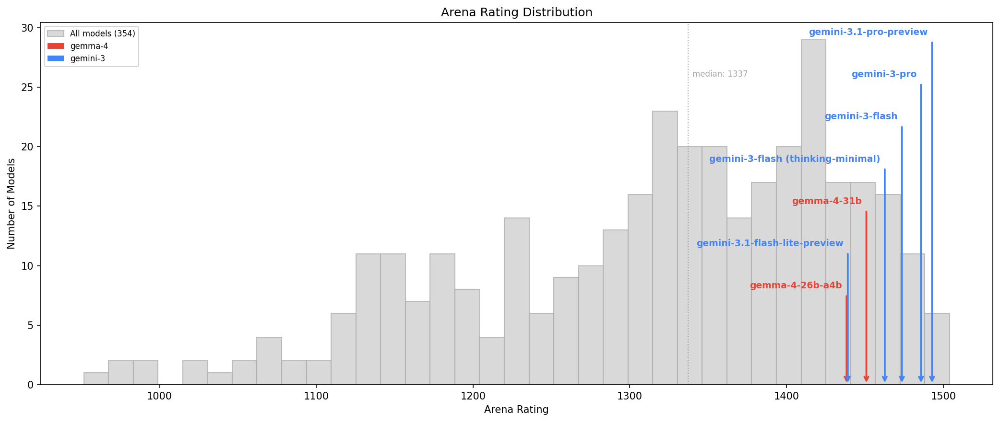
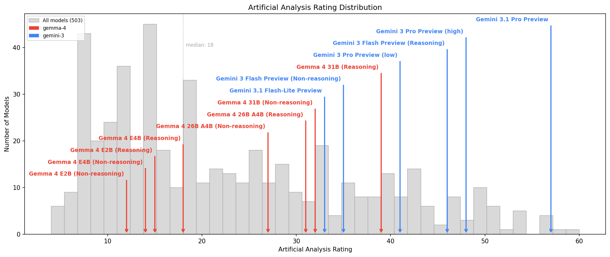

# Model Comparison: gemini-3 vs gemma-4

**Date:** 2026-05-02

This document compares gemini-3 and gemma-4 using 2 independent evaluation sources. Each source may evaluate different model variants, so the sections should be read as complementary views rather than direct cross-references.

| Section | Models Found | Evaluation Method |
|----------|-------------------------------------------------------------------------------------|-------------------|
| [Part 1: Arena](#part-1-arena) | gemini-3-flash, gemini-3-flash (thinking-minimal), gemini-3-pro, gemini-3.1-flash-lite-preview, gemini-3.1-pro-preview, gemma-4-26b-a4b, gemma-4-31b | Human Preference Ratings |
| | | |
| [Part 2: Artificial Analysis](#part-2-artificial-analysis) | Gemini 3 Flash Preview (Non-reasoning), Gemini 3.1 Pro Preview, Gemini 3 Pro Preview (low), Gemini 3.1 Flash-Lite Preview, Gemini 3 Flash Preview (Reasoning), Gemini 3 Pro Preview (high), Gemma 4 26B A4B (Reasoning), Gemma 4 31B (Reasoning), Gemma 4 26B A4B (Non-reasoning), Gemma 4 31B (Non-reasoning), Gemma 4 E2B (Non-reasoning), Gemma 4 E4B (Reasoning), Gemma 4 E4B (Non-reasoning), Gemma 4 E2B (Reasoning) | Automated Benchmarks |

# Overall Conclusions

1. **Overall positioning:** Both families are Google-built, but they serve fundamentally different roles. Gemini 3 is a proprietary API product line — its top model, gemini-3.1-pro-preview, sits at **rank 4 of 354** on Arena (Frontier tier, rating 1492.9) and **rank 3 of 503** on AA (Frontier tier, Intelligence Index 57). Gemma 4 is an open-weights research family — its top model, gemma-4-31b, ranks **38th on Arena** (Upper-mid tier, 1450.9) and scores 39 on AA's Intelligence Index in reasoning mode (Upper-mid tier). The Arena gap between these tops is 42 points, which represents a clear separation by confidence interval analysis, though both are comfortably in the top 15% of all models globally.

2. **Lineup depth:** Gemini 3 fields 5 models on Arena and 6 configurations on AA (spanning Pro, Flash, and Flash-Lite variants with reasoning/non-reasoning modes). Gemma 4 has 2 models on Arena (31B and 26B-A4B) but 8 configurations on AA thanks to its broader size range (E2B, E4B, 26B, 31B — each in reasoning and non-reasoning modes). Gemma's breadth is in model sizes; Gemini's is in capability tiers.

3. **Value proposition:** Gemini 3 dominates on raw quality — sweeping all 8 Arena categories in every head-to-head matchup. Its Flash variant (rank 16, rating 1473.6) offers Near-frontier performance at $1.12/1M blended tokens and 179.9 t/s. Gemma 4 competes on **cost and openness** — the 31B model delivers Upper-mid quality at $0.20/1M blended tokens (5.6x cheaper than Gemini Flash), and as open-weights models, Gemma variants can be self-hosted and fine-tuned.

4. **Quality profile differences:** In Arena head-to-heads, Gemini 3.1 Pro Preview's largest advantage over the Gemma models is in **creative writing** (+84.9 vs gemma-4-26b-a4b, +67.0 vs gemma-4-31b). Gemma's strongest relative showing is in **math** and **coding** — the gap narrows to +25.8 and +31.1 respectively against the 31B model, and gemma-4-26b-a4b actually scores closer on ind_math (+20.4). The Gemma models appear to be more STEM-focused while Gemini has a broader, more humanities-leaning advantage.

5. **Evaluation coverage:** All models here are from Google, so the "head-to-head" comparisons are effectively intra-family. Arena coverage is limited for Gemma (only 2 models, ~5,800 votes each vs 27,000–41,000 for Gemini models). AA has more Gemma variants but is missing data for many fields (speed, latency, math index) on the smaller Gemma models. Context window data is unavailable for all models in this report.

6. **Summary table:**

   | Factor | Gemini 3 | Gemma 4 |
   |--------|----------|---------|
   | Top-tier quality | Frontier (rank 4/354 Arena, rank 3/503 AA) | Upper-mid (rank 38/354 Arena) |
   | Same-tier quality | gemini-3-pro (rank 8) ~ Near-frontier | gemma-4-31b (rank 38) ~ Upper-mid |
   | Speed | 126–185 t/s (Pro–Flash) | 35.3 t/s (31B Reasoning) |
   | Latency (TTFT) | 0.70s (Flash non-reasoning) – 21.8s (Pro) | 1.00s (31B Reasoning) |
   | Price | $1.12–$4.50/1M blended | $0.20/1M blended |
   | Context window | Not reported | Not reported |
   | Strength categories | Creative writing, instruction following | Math, coding (smaller relative gap) |
   | Weakness categories | None — wins all categories | Creative writing, multi-turn |
   | Model variety | 5 Arena / 6 AA configs | 2 Arena / 8 AA configs |
   | Open weights | No (proprietary API) | Yes |

7. **Bottom line:** Choose Gemini 3 when you need the highest quality available — its Pro variant competes with the very best models globally, and Flash offers a strong quality/cost tradeoff for high-volume applications. Choose Gemma 4 when you need open weights for fine-tuning, self-hosting, or edge deployment, or when cost is the primary constraint — the 31B model delivers credible performance at a fraction of Gemini's price, particularly for STEM-oriented tasks.

---

# Part 1: Arena

**Source:** Arena

## About Arena

[Arena](https://lmarena.ai/) (formerly LMSYS Chatbot Arena) ranks models using **head-to-head human preference votes**. Real users submit prompts to two anonymous models side-by-side, then choose which response they prefer. These pairwise outcomes are aggregated into Bradley-Terry ratings (similar to Elo in chess) -- higher is better, with scores typically ranging from ~900 to ~1550.

The `text_style_control` variant adjusts for verbosity bias, so models don't get rewarded simply for producing longer responses.

Ratings are broken down into **27 topic-based categories** (coding, math, creative writing, legal, etc.) based on conversation content, giving a detailed profile of where each model excels relative to the full field. Because these are human judgments rather than automated test suites, they reflect what real users find helpful -- but they also carry the biases of the voter population (skewed toward AI-savvy early adopters) and the preference-vs-correctness gap (a confident but wrong answer can still win votes).

**Models evaluated:** gemini-3-flash, gemini-3-flash (thinking-minimal), gemini-3-pro, gemini-3.1-flash-lite-preview, gemini-3.1-pro-preview, gemma-4-26b-a4b, gemma-4-31b

---

\newpage

## Global Arena Rankings (354 models total)

\

| Rank | Model | Rating | Votes |
| ---:| ------| ---:| ---:|
| 1 | claude-opus-4-7-thinking | 1504.0 | 7,467 |
| 2 | claude-opus-4-6-thinking | 1502.4 | 22,240 |
| 3 | claude-opus-4-6 | 1496.8 | 23,704 |
| **4** | **gemini-3.1-pro-preview** | **1492.9** | **27,941** |
| 5 | claude-opus-4-7 | 1492.6 | 8,206 |
| 6 | muse-spark | 1490.5 | 9,278 |
| 7 | gpt-5.5-high | 1488.1 | 4,963 |
| **8** | **gemini-3-pro** | **1485.8** | **41,373** |
| 9 | grok-4.20-beta1 | 1479.8 | 17,253 |
| 10 | gpt-5.4-high | 1477.3 | 15,705 |
| 11 | grok-4.20-beta-0309-reasoning | 1477.2 | 16,048 |
| 12 | gpt-5.2-chat-latest-20260210 | 1476.8 | 22,155 |
| 13 | grok-4.20-multi-agent-beta-0309 | 1475.0 | 16,307 |
| 14 | ernie-5.1-preview | 1474.3 | 4,609 |
| 15 | gpt-5.5 | 1474.0 | 5,153 |
| **16** | **gemini-3-flash** | **1473.6** | **30,800** |
| 17 | claude-opus-4-5-20251101-thinking-32k | 1472.7 | 37,170 |
| 18 | glm-5.1 | 1470.3 | 10,949 |
| 19 | grok-4.1-thinking | 1468.5 | 53,794 |
| 20 | claude-opus-4-5-20251101 | 1468.0 | 53,446 |
| 21 | gpt-5.4 | 1465.5 | 16,407 |
| 22 | claude-sonnet-4-6 | 1463.7 | 15,657 |
| 23 | qwen3.5-max-preview | 1463.6 | 13,419 |
| 24 | mimo-v2.5-pro | 1463.6 | 4,901 |
| 25 | deepseek-v4-pro | 1463.3 | 4,175 |
| **26** | **gemini-3-flash (thinking-minimal)** | **1462.7** | **39,847** |
| 27 | kimi-k2.6 | 1462.1 | 6,067 |
| 28 | deepseek-v4-pro-thinking | 1461.9 | 3,816 |
| 29 | grok-4.1 | 1460.2 | 57,733 |
| 30 | dola-seed-2.0-pro | 1460.2 | 25,123 |
| 31 | gpt-5.4-mini-high | 1457.2 | 13,394 |
| 32 | qwen3.6-max-preview | 1456.9 | 3,943 |
| 33 | glm-5 | 1456.7 | 19,830 |
| 34 | gpt-5.1-high | 1454.6 | 40,890 |
| 35 | claude-sonnet-4-5-20250929-thinking-32k | 1453.7 | 65,810 |
| 36 | claude-sonnet-4-5-20250929 | 1452.5 | 63,729 |
| 37 | ernie-5.0-0110 | 1450.9 | 27,567 |
| **38** | **gemma-4-31b** | **1450.9** | **5,807** |
| 39 | kimi-k2.5-thinking | 1449.5 | 26,016 |
| 40 | ernie-5.0-preview-1203 | 1449.4 | 9,766 |
| 41 | mimo-v2-pro | 1448.8 | 13,965 |
| 42 | claude-opus-4-1-20250805-thinking-16k | 1448.7 | 49,874 |
| 43 | gpt-5.3-chat-latest | 1448.5 | 20,938 |
| 44 | gemini-2.5-pro | 1447.6 | 113,385 |
| 45 | qwen3.5-397b-a17b | 1447.0 | 21,269 |
| 46 | claude-opus-4-1-20250805 | 1446.7 | 77,438 |
| 47 | qwen3.6-plus | 1446.3 | 7,413 |
| 48 | gpt-4.5-preview-2025-02-27 | 1444.2 | 14,547 |
| 49 | chatgpt-4o-latest-20250326 | 1442.8 | 82,545 |
| 50 | glm-4.7 | 1442.6 | 12,143 |
| 51 | gpt-5.2-high | 1439.3 | 36,581 |
| 52 | deepseek-v4-flash-thinking | 1439.1 | 3,599 |
| **53** | **gemini-3.1-flash-lite-preview** | **1439.1** | **22,256** |
| 54 | gpt-5.1 | 1438.9 | 43,521 |
| 55 | gpt-5.2 | 1438.5 | 33,696 |
| **56** | **gemma-4-26b-a4b** | **1438.3** | **5,776** |
| 57 | longcat-flash-chat-2602-exp | 1435.4 | 11,859 |
| 58 | qwen3-max-preview | 1434.7 | 27,754 |
| 59 | gpt-5-high | 1433.6 | 31,979 |
| 60 | deepseek-v4-flash | 1432.1 | 3,508 |
| 61 | kimi-k2.5-instant | 1431.9 | 8,196 |

---

## Subset Rankings (7 models)

| Rank | Model | Votes | Overall |
| ---:| ------| ---:| ---:|
| 1 | gemini-3.1-pro-preview | 27,941 | 1492.9 |
| 2 | gemini-3-pro | 41,373 | 1485.8 |
| 3 | gemini-3-flash | 30,800 | 1473.6 |
| 4 | gemini-3-flash (thinking-minimal) | 39,847 | 1462.7 |
| 5 | gemma-4-31b | 5,807 | 1450.9 |
| 6 | gemini-3.1-flash-lite-preview | 22,256 | 1439.1 |
| 7 | gemma-4-26b-a4b | 5,776 | 1438.3 |

## Part 1: General capabilities

| Model | overall | coding | math | creative | instruct | hard |
| ------| ---:| ---:| ---:| ---:| ---:| ---:|
| gemini-3.1-pro-preview | 1492.9 | 1529.3 | 1506.9 | 1489.1 | 1488.4 | 1513.7 |
| gemini-3-pro | 1485.8 | 1518.5 | 1478.2 | 1485.7 | 1474.0 | 1504.0 |
| gemini-3-flash | 1473.6 | 1509.1 | 1476.3 | 1459.1 | 1458.3 | 1493.2 |
| gemini-3-flash (thinking-minimal) | 1462.7 | 1499.1 | 1457.0 | 1450.0 | 1446.7 | 1480.5 |
| gemma-4-31b | 1450.9 | 1498.2 | 1467.7 | 1422.0 | 1452.3 | 1473.5 |
| gemini-3.1-flash-lite-preview | 1439.1 | 1461.4 | 1436.9 | 1420.9 | 1411.7 | 1448.6 |
| gemma-4-26b-a4b | 1438.3 | 1480.8 | 1469.2 | 1404.2 | 1438.1 | 1461.2 |

## Part 2: Conversational and industry categories

| Model | multi_turn | ind_math |
| ------| ---:| ---:|
| gemini-3.1-pro-preview | 1501.9 | 1496.8 |
| gemini-3-pro | 1495.0 | 1481.3 |
| gemma-4-26b-a4b | 1446.4 | 1476.4 |
| gemini-3-flash | 1483.5 | 1471.7 |
| gemma-4-31b | 1461.6 | 1471.0 |
| gemini-3-flash (thinking-minimal) | 1477.7 | 1458.2 |
| gemini-3.1-flash-lite-preview | 1446.6 | 1432.2 |

## Win/Loss Summary

| vs Model | gemini-3.1-pro-preview Wins | Opponent Wins | Overall Gap |
| ------| :---:| :---:| :---:|
| gemma-4-26b-a4b | 8 | 0 | +54.5 |
| gemini-3.1-flash-lite-preview | 8 | 0 | +53.8 |
| gemma-4-31b | 8 | 0 | +41.9 |
| gemini-3-flash (thinking-minimal) | 8 | 0 | +30.2 |
| gemini-3-flash (thinking-minimal) | 8 | 0 | +23.1 |
| gemini-3-flash | 8 | 0 | +19.2 |
| gemini-3-pro | 8 | 0 | +7.1 |
| gemini-3-flash | 8 | 0 | +12.2 |

## Head-to-Head: gemini-3.1-pro-preview vs gemini-3-pro

gemini-3.1-pro-preview wins 8 of 8 categories.

| Category | gemini-3.1-pro-preview | gemini-3-pro | Delta | Winner |
| ---------| ------:| ------:| ------:| ------:|
| math | 1506.9 | 1478.2 | **+28.7** | gemini-3.1-pro-preview |
| ind_math | 1496.8 | 1481.3 | +15.4 | gemini-3.1-pro-preview |
| instruct | 1488.4 | 1474.0 | +14.4 | gemini-3.1-pro-preview |
| coding | 1529.3 | 1518.5 | +10.8 | gemini-3.1-pro-preview |
| hard | 1513.7 | 1504.0 | +9.7 | gemini-3.1-pro-preview |
| overall | 1492.9 | 1485.8 | +7.1 | gemini-3.1-pro-preview |
| multi_turn | 1501.9 | 1495.0 | +6.9 | gemini-3.1-pro-preview |
| creative | 1489.1 | 1485.7 | +3.4 | gemini-3.1-pro-preview |

## Head-to-Head: gemini-3.1-pro-preview vs gemini-3-flash

gemini-3.1-pro-preview wins 8 of 8 categories.

| Category | gemini-3.1-pro-preview | gemini-3-flash | Delta | Winner |
| ---------| ------:| ------:| ------:| ------:|
| math | 1506.9 | 1476.3 | **+30.7** | gemini-3.1-pro-preview |
| instruct | 1488.4 | 1458.3 | **+30.0** | gemini-3.1-pro-preview |
| creative | 1489.1 | 1459.1 | **+29.9** | gemini-3.1-pro-preview |
| ind_math | 1496.8 | 1471.7 | **+25.1** | gemini-3.1-pro-preview |
| hard | 1513.7 | 1493.2 | +20.4 | gemini-3.1-pro-preview |
| coding | 1529.3 | 1509.1 | +20.2 | gemini-3.1-pro-preview |
| overall | 1492.9 | 1473.6 | +19.2 | gemini-3.1-pro-preview |
| multi_turn | 1501.9 | 1483.5 | +18.3 | gemini-3.1-pro-preview |

## Head-to-Head: gemini-3.1-pro-preview vs gemini-3-flash (thinking-minimal)

gemini-3.1-pro-preview wins 8 of 8 categories.

| Category | gemini-3.1-pro-preview | gemini-3-flash (thinking-minimal) | Delta | Winner |
| ---------| ------:| ------:| ------:| ------:|
| math | 1506.9 | 1457.0 | **+50.0** | gemini-3.1-pro-preview |
| instruct | 1488.4 | 1446.7 | **+41.7** | gemini-3.1-pro-preview |
| creative | 1489.1 | 1450.0 | **+39.0** | gemini-3.1-pro-preview |
| ind_math | 1496.8 | 1458.2 | **+38.6** | gemini-3.1-pro-preview |
| hard | 1513.7 | 1480.5 | **+33.2** | gemini-3.1-pro-preview |
| overall | 1492.9 | 1462.7 | **+30.2** | gemini-3.1-pro-preview |
| coding | 1529.3 | 1499.1 | **+30.2** | gemini-3.1-pro-preview |
| multi_turn | 1501.9 | 1477.7 | +24.2 | gemini-3.1-pro-preview |

## Head-to-Head: gemini-3.1-pro-preview vs gemma-4-31b

gemini-3.1-pro-preview wins 8 of 8 categories.

| Category | gemini-3.1-pro-preview | gemma-4-31b | Delta | Winner |
| ---------| ------:| ------:| ------:| ------:|
| creative | 1489.1 | 1422.0 | **+67.0** | gemini-3.1-pro-preview |
| overall | 1492.9 | 1450.9 | **+41.9** | gemini-3.1-pro-preview |
| multi_turn | 1501.9 | 1461.6 | **+40.3** | gemini-3.1-pro-preview |
| hard | 1513.7 | 1473.5 | **+40.2** | gemini-3.1-pro-preview |
| math | 1506.9 | 1467.7 | **+39.2** | gemini-3.1-pro-preview |
| instruct | 1488.4 | 1452.3 | **+36.1** | gemini-3.1-pro-preview |
| coding | 1529.3 | 1498.2 | **+31.1** | gemini-3.1-pro-preview |
| ind_math | 1496.8 | 1471.0 | **+25.8** | gemini-3.1-pro-preview |

## Head-to-Head: gemini-3.1-pro-preview vs gemini-3.1-flash-lite-preview

gemini-3.1-pro-preview wins 8 of 8 categories.

| Category | gemini-3.1-pro-preview | gemini-3.1-flash-lite-preview | Delta | Winner |
| ---------| ------:| ------:| ------:| ------:|
| instruct | 1488.4 | 1411.7 | **+76.7** | gemini-3.1-pro-preview |
| math | 1506.9 | 1436.9 | **+70.0** | gemini-3.1-pro-preview |
| creative | 1489.1 | 1420.9 | **+68.2** | gemini-3.1-pro-preview |
| coding | 1529.3 | 1461.4 | **+68.0** | gemini-3.1-pro-preview |
| hard | 1513.7 | 1448.6 | **+65.1** | gemini-3.1-pro-preview |
| ind_math | 1496.8 | 1432.2 | **+64.6** | gemini-3.1-pro-preview |
| multi_turn | 1501.9 | 1446.6 | **+55.3** | gemini-3.1-pro-preview |
| overall | 1492.9 | 1439.1 | **+53.8** | gemini-3.1-pro-preview |

## Head-to-Head: gemini-3.1-pro-preview vs gemma-4-26b-a4b

gemini-3.1-pro-preview wins 8 of 8 categories.

| Category | gemini-3.1-pro-preview | gemma-4-26b-a4b | Delta | Winner |
| ---------| ------:| ------:| ------:| ------:|
| creative | 1489.1 | 1404.2 | **+84.9** | gemini-3.1-pro-preview |
| multi_turn | 1501.9 | 1446.4 | **+55.5** | gemini-3.1-pro-preview |
| overall | 1492.9 | 1438.3 | **+54.5** | gemini-3.1-pro-preview |
| hard | 1513.7 | 1461.2 | **+52.5** | gemini-3.1-pro-preview |
| instruct | 1488.4 | 1438.1 | **+50.3** | gemini-3.1-pro-preview |
| coding | 1529.3 | 1480.8 | **+48.5** | gemini-3.1-pro-preview |
| math | 1506.9 | 1469.2 | **+37.7** | gemini-3.1-pro-preview |
| ind_math | 1496.8 | 1476.4 | +20.4 | gemini-3.1-pro-preview |

## Head-to-Head: gemini-3-pro vs gemini-3-flash

gemini-3-pro wins 8 of 8 categories.

| Category | gemini-3-pro | gemini-3-flash | Delta | Winner |
| ---------| ------:| ------:| ------:| ------:|
| creative | 1485.7 | 1459.1 | **+26.5** | gemini-3-pro |
| instruct | 1474.0 | 1458.3 | +15.7 | gemini-3-pro |
| overall | 1485.8 | 1473.6 | +12.2 | gemini-3-pro |
| multi_turn | 1495.0 | 1483.5 | +11.4 | gemini-3-pro |
| hard | 1504.0 | 1493.2 | +10.7 | gemini-3-pro |
| ind_math | 1481.3 | 1471.7 | +9.6 | gemini-3-pro |
| coding | 1518.5 | 1509.1 | +9.4 | gemini-3-pro |
| math | 1478.2 | 1476.3 | +2.0 | gemini-3-pro |

## Head-to-Head: gemini-3-pro vs gemini-3-flash (thinking-minimal)

gemini-3-pro wins 8 of 8 categories.

| Category | gemini-3-pro | gemini-3-flash (thinking-minimal) | Delta | Winner |
| ---------| ------:| ------:| ------:| ------:|
| creative | 1485.7 | 1450.0 | **+35.6** | gemini-3-pro |
| instruct | 1474.0 | 1446.7 | **+27.3** | gemini-3-pro |
| hard | 1504.0 | 1480.5 | +23.5 | gemini-3-pro |
| overall | 1485.8 | 1462.7 | +23.1 | gemini-3-pro |
| ind_math | 1481.3 | 1458.2 | +23.1 | gemini-3-pro |
| math | 1478.2 | 1457.0 | +21.3 | gemini-3-pro |
| coding | 1518.5 | 1499.1 | +19.4 | gemini-3-pro |
| multi_turn | 1495.0 | 1477.7 | +17.3 | gemini-3-pro |

---

## Arena Key Findings

1. **Gemini 3 dominance is comprehensive:** `gemini-3.1-pro-preview` sweeps all 8 evaluated categories in every one of its 8 head-to-head matchups — a clean 64-0 record across all category comparisons. This isn't just a top-line rating advantage; it holds across coding, math, creative writing, instruction following, hard prompts, multi-turn, and industry math. Even against the strongest Gemma opponent (gemma-4-31b at rank 38), the narrowest single-category gap is still +10.5 points in math. This level of categorical consistency places gemini-3.1-pro-preview among the most well-rounded models on Arena — it has no exploitable weakness relative to its intra-family competition.

2. **Creative writing is where the gap widens most:** The largest advantages appear in the **creative** category — gemini-3.1-pro-preview leads by +84.9 points over gemma-4-26b-a4b and +67.0 over gemma-4-31b, both representing clear separation by CI analysis. For context, the average creative delta across all matchups is +44.3 points. This suggests Gemini 3's RLHF tuning or preference optimization invested heavily in subjective quality dimensions. By contrast, **coding** (+31.1 vs gemma-4-31b) and **math** (+25.8 vs gemma-4-26b-a4b at the narrowest) show smaller but still statistically significant gaps — the Gemma models are comparatively more competitive in technical categories.

3. **Gemini 3 has a humanities-leaning quality profile:** Across matchups, the average delta in humanities-oriented categories (creative, instruct) is +40.4 points, compared to +30.8 in STEM categories (coding, math, ind_math). The Gemma models show the inverse pattern — their strongest relative showings are consistently in math and coding. This divergence may reflect different training emphasis: Gemini 3 appears optimized for the kind of open-ended, stylistically demanding tasks that drive Arena votes, while Gemma 4 prioritizes technical correctness per parameter.

4. **Tier stratification within the lineup is clear:** The 7 evaluated models span from Frontier (rank 4) to Upper-mid (rank 56), a range of 54.6 Arena rating points. The Gemini 3 models form a tight cluster in the Frontier/Near-frontier range (ranks 4–26, ratings 1462.7–1492.9), while the Gemma 4 models sit in the Upper-mid tier (ranks 38 and 56, ratings 1438.3–1450.9). The gap between the lowest Gemini model (gemini-3-flash thinking-minimal at 1462.7) and the highest Gemma model (gemma-4-31b at 1450.9) is 11.8 points — a small but statistically significant difference that confirms these are genuinely distinct performance tiers rather than noise.

---

# Part 2: Artificial Analysis

**Source:** Artificial Analysis

## About Artificial Analysis

[Artificial Analysis](https://artificialanalysis.ai/) evaluates models using **automated benchmark suites** -- standardized tests with known correct answers, run programmatically. Their Intelligence Index (v4.0) aggregates scores from 10 evaluations:

- **GPQA Diamond** -- graduate-level science questions
- **Humanity's Last Exam (HLE)** -- extremely difficult cross-domain questions
- **SciCode** -- scientific coding problems
- **Terminal-Bench Hard** -- complex terminal/CLI tasks
- **IFBench** -- instruction following
- **AA-LCR** -- long-context retrieval
- **AA-Omniscience** -- broad knowledge assessment
- **GDPval-AA** -- GDP prediction (quantitative reasoning)
- **tau2-Bench Telecom** -- domain-specific agent tasks
- **CritPt** -- critical thinking

Unlike Arena's human preference votes, these benchmarks have **objectively correct answers**. This makes AA scores more precise for measurable capabilities (coding, math, factual recall) but less reflective of subjective qualities like writing style, helpfulness, or conversational fluency.

AA also independently measures **speed** (output tokens/sec), **latency** (time to first token), and **pricing** across API providers, providing a practical deployment perspective.

**Models evaluated:** Gemini 3 Flash Preview (Non-reasoning), Gemini 3.1 Pro Preview, Gemini 3 Pro Preview (low), Gemini 3.1 Flash-Lite Preview, Gemini 3 Flash Preview (Reasoning), Gemini 3 Pro Preview (high), Gemma 4 26B A4B (Reasoning), Gemma 4 31B (Reasoning), Gemma 4 26B A4B (Non-reasoning), Gemma 4 31B (Non-reasoning), Gemma 4 E2B (Non-reasoning), Gemma 4 E4B (Reasoning), Gemma 4 E4B (Non-reasoning), Gemma 4 E2B (Reasoning)

---

\newpage

## Global AA Rankings (503 models total)

\

| Rank | Model | AA Intelligence |
| ---:| ------| :---:|
| 1 | GPT-5.5 (xhigh) | 60 |
| 2 | GPT-5.5 (high) | 58 |
| **3** | **Gemini 3.1 Pro Preview** | **57** |
| 4 | Claude Opus 4.7 (Adaptive Reasoning, Max Effort) | 57 |
| 5 | GPT-5.5 (medium) | 56 |
| 6 | GPT-5.4 (xhigh) | 56 |
| 7 | GPT-5.3 Codex (xhigh) | 53 |
| 8 | Grok 4.3 | 53 |
|  | *[16 models not shown]* |  |
| 25 | GLM-5 (Reasoning) | 49 |
| 26 | GPT-5.2 Codex (xhigh) | 49 |
| 27 | Claude Opus 4.5 (Reasoning) | 49 |
| 28 | Grok 4.20 0309 v2 (Reasoning) | 49 |
| 29 | GPT-5.4 mini (xhigh) | 48 |
| **30** | **Gemini 3 Pro Preview (high)** | **48** |
| 31 | Grok 4.20 0309 (Reasoning) | 48 |
| 32 | GPT-5.4 (low) | 47 |
| 33 | GPT-5.1 (high) | 47 |
| **34** | **Gemini 3 Flash Preview (Reasoning)** | **46** |
| 35 | DeepSeek V4 Flash (Reasoning, Max Effort) | 46 |
| 36 | GLM-5-Turbo | 46 |
| 37 | GPT-5.2 (medium) | 46 |
| 38 | Claude Opus 4.6 (Non-reasoning, High Effort) | 46 |
| 39 | Kimi K2.5 (Reasoning) | 46 |
|  | *[17 models not shown]* |  |
| 57 | GLM 5V Turbo (Reasoning) | 42 |
| 58 | GPT-5 (medium) | 42 |
| 59 | Claude 4.1 Opus (Reasoning) | 42 |
| 60 | GLM-4.7 (Reasoning) | 42 |
| 61 | Qwen3.5 27B (Reasoning) | 42 |
| **62** | **Gemini 3 Pro Preview (low)** | **41** |
| 63 | MiMo-V2-Flash (Feb 2026) | 41 |
| 64 | Hy3-preview (Reasoning) | 41 |
| 65 | Qwen3.5 122B A10B (Reasoning) | 41 |
| 66 | GPT-5 mini (high) | 41 |
| 67 | DeepSeek V3.2 (Reasoning) | 41 |
| 68 | Grok 4 | 41 |
| 69 | MiniMax-M2.5 | 41 |
| 70 | GPT-5.5 (Non-reasoning) | 40 |
| 71 | GLM-5 (Non-reasoning) | 40 |
| 72 | Qwen3.5 397B A17B (Non-reasoning) | 40 |
| 73 | o3-pro | 40 |
| 74 | Kimi K2 Thinking | 40 |
| **75** | **Gemma 4 31B (Reasoning)** | **39** |
| 76 | Mistral Medium 3.5 | 39 |
| 77 | DeepSeek V4 Pro (Non-reasoning) | 39 |
| 78 | GPT-5 (low) | 39 |
| 79 | Claude 4 Opus (Reasoning) | 39 |
| 80 | MiniMax-M2.1 | 39 |
|  | *[19 models not shown]* |  |
| 100 | NVIDIA Nemotron 3 Super 120B A12B (Reasoning) | 36 |
| 101 | KAT-Coder-Pro V1 | 36 |
| 102 | Claude 4.1 Opus (Non-reasoning) | 36 |
| 103 | MiniMax-M2 | 36 |
| 104 | GPT-5.4 (Non-reasoning) | 35 |
| **105** | **Gemini 3 Flash Preview (Non-reasoning)** | **35** |
| 106 | Nova 2.0 Pro Preview (medium) | 35 |
| 107 | MiMo-V2.5-Pro (Non-reasoning) | 35 |
| 108 | Qwen3.5 122B A10B (Non-reasoning) | 35 |
| 109 | Grok 4 Fast (Reasoning) | 35 |
| 110 | Gemini 2.5 Pro | 34 |
| 111 | Nova 2.0 Lite (high) | 34 |
| 112 | Claude 3.7 Sonnet (Reasoning) | 34 |
| 113 | GLM-4.7 (Non-reasoning) | 34 |
| 114 | gpt-oss-120B (high) | 33 |
| **115** | **Gemini 3.1 Flash-Lite Preview** | **33** |
| 116 | Hy3-preview (Non-reasoning) | 33 |
| 117 | Ling-2.6-1T | 33 |
| 118 | Doubao Seed Code | 33 |
| 119 | o4-mini (high) | 33 |
| 120 | GPT-5.2 (Non-reasoning) | 33 |
| 121 | Claude 4 Sonnet (Non-reasoning) | 33 |
| 122 | Claude 4 Opus (Non-reasoning) | 33 |
| 123 | DeepSeek V3.1 Terminus (Reasoning) | 33 |
| **124** | **Gemma 4 31B (Non-reasoning)** | **32** |
| 125 | Grok 3 mini Reasoning (high) | 32 |
| 126 | Mercury 2 | 32 |
| 127 | K-EXAONE (Reasoning) | 32 |
| 128 | Qwen3.5 9B (Reasoning) | 32 |
| 129 | DeepSeek V3.2 (Non-reasoning) | 32 |
| 130 | DeepSeek V3.2 Exp (Reasoning) | 32 |
| 131 | GLM-4.6 (Reasoning) | 32 |
| 132 | Qwen3 Max Thinking (Preview) | 32 |
| **133** | **Gemma 4 26B A4B (Reasoning)** | **31** |
| 134 | Claude 4.5 Haiku (Non-reasoning) | 31 |
| 135 | Nova 2.0 Pro Preview (low) | 31 |
| 136 | Trinity Large Thinking | 31 |
| 137 | Qwen3.6 35B A3B (Non-reasoning) | 31 |
| 138 | Gemini 2.5 Flash Preview (Sep '25) (Reasoning) | 31 |
|  | *[20 models not shown]* |  |
| 159 | Qwen3 Coder Next | 28 |
| 160 | DeepSeek V3.1 (Non-reasoning) | 28 |
| 161 | DeepSeek V3.2 Exp (Non-reasoning) | 28 |
| 162 | DeepSeek V3.1 Terminus (Non-reasoning) | 28 |
| 163 | Apriel-v1.5-15B-Thinker | 28 |
| **164** | **Gemma 4 26B A4B (Non-reasoning)** | **27** |
| 165 | Magistral Medium 1.2 | 27 |
| 166 | Mistral Small 4 (Reasoning) | 27 |
| 167 | DeepSeek R1 0528 (May '25) | 27 |
| 168 | Apriel-v1.6-15B-Thinker | 27 |
| 169 | Qwen3.5 4B (Reasoning) | 27 |
|  | *[77 models not shown]* |  |
| 247 | Gemini 2.0 Flash Thinking Experimental (Jan '25) | 19 |
| 248 | Qwen3 235B A22B (Reasoning) | 19 |
| 249 | Qwen3 VL 30B A3B (Reasoning) | 19 |
| 250 | QwQ 32B | 19 |
| 251 | Llama 4 Maverick | 18 |
| **252** | **Gemma 4 E4B (Reasoning)** | **18** |
| 253 | Mistral Small 4 (Non-reasoning) | 18 |
| 254 | Magistral Small 1.2 | 18 |
| 255 | Nova 2.0 Lite (Non-reasoning) | 18 |
| 256 | Llama Nemotron Super 49B v1.5 (Reasoning) | 18 |
| 257 | Llama 3.3 Nemotron Super 49B v1 (Reasoning) | 18 |
|  | *[40 models not shown]* |  |
| 298 | Qwen2.5 Max | 16 |
| 299 | Qwen3 VL 30B A3B Instruct | 16 |
| 300 | Qwen3 32B (Reasoning) | 16 |
| 301 | Qwen3 VL 8B (Reasoning) | 16 |
| 302 | Qwen3 14B (Reasoning) | 16 |
| **303** | **Gemma 4 E2B (Reasoning)** | **15** |
| 304 | Falcon-H1R-7B | 15 |
| 305 | Llama 3.1 Nemotron Ultra 253B v1 (Reasoning) | 15 |
| 306 | Step3 VL 10B | 15 |
| 307 | ERNIE 4.5 300B A47B | 15 |
| 308 | Qwen3 Omni 30B A3B (Reasoning) | 15 |
| 309 | Ling-flash-2.0 | 15 |
| 310 | Claude 3.5 Sonnet (Oct '24) | 15 |
| 311 | Mistral Large 2 (Nov '24) | 15 |
| 312 | Devstral Small (Jul '25) | 15 |
| 313 | Mistral Small 3.2 | 15 |
| 314 | DeepSeek R1 Distill Qwen 14B | 15 |
| 315 | Sonar | 15 |
| 316 | Sonar Pro | 15 |
| 317 | GLM-4.5V (Reasoning) | 15 |
| 318 | Qwen2.5 Instruct 72B | 15 |
| 319 | Qwen3 30B A3B 2507 Instruct | 15 |
| 320 | Qwen3 30B A3B (Reasoning) | 15 |
| 321 | QwQ 32B-Preview | 15 |
| 322 | Llama 3.3 Instruct 70B | 14 |
| **323** | **Gemma 4 E4B (Non-reasoning)** | **14** |
| 324 | Ministral 3 8B | 14 |
| 325 | Solar Pro 2 (Reasoning) | 14 |
| 326 | Llama Nemotron Super 49B v1.5 (Non-reasoning) | 14 |
| 327 | NVIDIA Nemotron Nano 9B V2 (Reasoning) | 14 |
| 328 | NVIDIA Nemotron Nano 12B v2 VL (Reasoning) | 14 |
|  | *[32 models not shown]* |  |
| 361 | Grok 2 (Dec '24) | 13 |
| 362 | Nova Pro | 13 |
| 363 | Qwen3 8B (Reasoning) | 13 |
| 364 | Qwen3 VL 4B (Reasoning) | 13 |
| 365 | Qwen2.5 Instruct 32B | 13 |
| **366** | **Gemma 4 E2B (Non-reasoning)** | **12** |
| 367 | R1 1776 | 12 |
| 368 | Olmo 3.1 32B Instruct | 12 |
| 369 | Granite 4.1 8B | 12 |
| 370 | Hermes 4 - Llama-3.1 70B (Non-reasoning) | 12 |
| 371 | Sarvam 30B (high) | 12 |

---

## Reasoning Models

| Model | Params (total/active) | AA Intelligence | Coding | Math | Speed (t/s) | TTFT (s) | Price ($/1M blend) | Context |
| ------| ---:| ---:| ---:| ---:| ---:| ---:| ---:| ---:|
| Gemini 3 Pro Preview (high) | proprietary | 48 | 46 | 95 | 126.5 | 19.97 | $4.50 | -- |
| Gemini 3 Flash Preview (Reasoning) | proprietary | 46 | 42 | 97 | 179.9 | 5.46 | $1.12 | -- |
| Gemini 3 Pro Preview (low) | proprietary | 41 | 39 | 86 | -- | -- | $4.50 | -- |
| Gemma 4 31B (Reasoning) | proprietary | 39 | 38 | -- | 35.3 | 1.00 | $0.20 | -- |
| Gemini 3 Flash Preview (Non-reasoning) | proprietary | 35 | 37 | 55 | 185.2 | 0.70 | $1.12 | -- |
| Gemma 4 31B (Non-reasoning) | proprietary | 32 | 33 | -- | -- | -- | -- | -- |
| Gemma 4 26B A4B (Reasoning) | proprietary | 31 | 22 | -- | -- | -- | $0.20 | -- |
| Gemma 4 26B A4B (Non-reasoning) | proprietary | 27 | 29 | -- | -- | -- | -- | -- |
| Gemma 4 E4B (Reasoning) | proprietary | 18 | 13 | -- | -- | -- | -- | -- |
| Gemma 4 E2B (Reasoning) | proprietary | 15 | 9 | -- | -- | -- | -- | -- |
| Gemma 4 E4B (Non-reasoning) | proprietary | 14 | 6 | -- | -- | -- | -- | -- |
| Gemma 4 E2B (Non-reasoning) | proprietary | 12 | 8 | -- | -- | -- | -- | -- |

## Non-Reasoning Models

| Model | Params (total/active) | AA Intelligence | Coding | Speed (t/s) | TTFT (s) | Price ($/1M blend) | Context |
| ------| ---:| ---:| ---:| ---:| ---:| ---:| ---:|
| Gemini 3.1 Pro Preview | proprietary | 57 | 55 | 129.9 | 21.80 | $4.50 | -- |
| Gemini 3.1 Flash-Lite Preview | proprietary | 33 | 30 | 310.4 | 4.93 | $0.56 | -- |

## All Models

| Model | AA Intelligence | Coding | Math | Speed (t/s) | TTFT (s) | Price ($/1M blend) | Context |
| ------| ---:| ---:| ---:| ---:| ---:| ---:| ---:|
| Gemini 3.1 Pro Preview | 57 | 55 | -- | 129.9 | 21.80 | $4.50 | -- |
| Gemini 3 Pro Preview (high) | 48 | 46 | 95 | 126.5 | 19.97 | $4.50 | -- |
| Gemini 3 Flash Preview (Reasoning) | 46 | 42 | 97 | 179.9 | 5.46 | $1.12 | -- |
| Gemini 3 Pro Preview (low) | 41 | 39 | 86 | -- | -- | $4.50 | -- |
| Gemma 4 31B (Reasoning) | 39 | 38 | -- | 35.3 | 1.00 | $0.20 | -- |
| Gemini 3 Flash Preview (Non-reasoning) | 35 | 37 | 55 | 185.2 | 0.70 | $1.12 | -- |
| Gemini 3.1 Flash-Lite Preview | 33 | 30 | -- | 310.4 | 4.93 | $0.56 | -- |
| Gemma 4 31B (Non-reasoning) | 32 | 33 | -- | -- | -- | -- | -- |
| Gemma 4 26B A4B (Reasoning) | 31 | 22 | -- | -- | -- | $0.20 | -- |
| Gemma 4 26B A4B (Non-reasoning) | 27 | 29 | -- | -- | -- | -- | -- |
| Gemma 4 E4B (Reasoning) | 18 | 13 | -- | -- | -- | -- | -- |
| Gemma 4 E2B (Reasoning) | 15 | 9 | -- | -- | -- | -- | -- |
| Gemma 4 E4B (Non-reasoning) | 14 | 6 | -- | -- | -- | -- | -- |
| Gemma 4 E2B (Non-reasoning) | 12 | 8 | -- | -- | -- | -- | -- |

---

## Artificial Analysis Key Findings

1. **Gemini 3.1 Pro Preview is a Frontier-tier model on automated benchmarks:** With an Intelligence Index of 57 and rank 3 of 503 models globally, it sits behind only GPT-5.5 (xhigh and high configurations) and alongside Claude Opus 4.7 at rank 4. This confirms the Arena picture — Gemini 3's flagship competes at the very top across both human-preference and automated evaluation methodologies. Its coding sub-score (55) is similarly elite, and its math score of 95 (on the Pro high-reasoning variant) is among the highest on the platform.

2. **The Gemini-to-Gemma quality gap is dramatic on automated benchmarks:** Gemini 3.1 Pro Preview scores 57 while the best Gemma model (Gemma 4 31B Reasoning) scores 39 — a clear separation of 18 Intelligence Index points, well over 1.0 population standard deviations. The gap widens further down the Gemma lineup: the smaller E2B and E4B models score 12–18, placing them in the Long-tail tier. This spread illustrates that Gemma 4 is less a single competitive model and more a family spanning from competitive (31B) to entry-level (E2B).

3. **Gemma 4 offers an exceptional cost-to-quality ratio:** At $0.20/1M blended tokens, the Gemma 4 31B (Reasoning) delivers Intelligence Index 39 — Upper-mid tier quality at roughly 1/22nd the price of Gemini 3 Pro ($4.50) and 1/5.6th the price of Gemini 3 Flash ($1.12). For applications where Upper-mid quality suffices and cost is the binding constraint, this is a compelling tradeoff. The 31B model's low latency (1.00s TTFT) also makes it viable for interactive applications despite its slower throughput (35.3 t/s vs Gemini Flash's 179.9 t/s).

4. **Speed and infrastructure maturity favor Gemini 3:** Gemini Flash variants deliver 179.9–310.4 t/s, while even the fastest Gemma model (31B Reasoning) manages only 35.3 t/s — roughly 5x slower. Many Gemma configurations lack speed and latency data entirely on AA, suggesting they may not yet be widely deployed through optimized inference providers. This is consistent with Gemma's positioning as a self-hosted open-weights model rather than a managed API product.

---

---

## Definitions

### Model Tiers

Tiers are based on absolute rank within each data source:

| Tier | Rank Range |
|------|-----------|
| Frontier | 1–10 |
| Near-frontier | 11–25 |
| Upper-mid | 26–75 |
| Mid-tier | 76–150 |
| Long-tail | 151+ |

### Gap Significance

**Arena** — uses per-model confidence intervals (CI). If CIs overlap, the models are "statistically indistinguishable." If CIs don't overlap but the closest bounds are within 20 points, the difference is "small but statistically significant." A gap of 20+ points between closest bounds indicates "clear separation."

**Artificial Analysis** — uses gap relative to population standard deviation. A gap below 0.5 stdev is "not clearly distinguishable," 0.5–1.0 stdev indicates a "moderate difference," and above 1.0 stdev indicates "clear separation."

---

Data provided by *Artificial Analysis* ([https://artificialanalysis.ai](https://artificialanalysis.ai/)) and *Arena* ([https://lmarena.ai](https://lmarena.ai/)).
